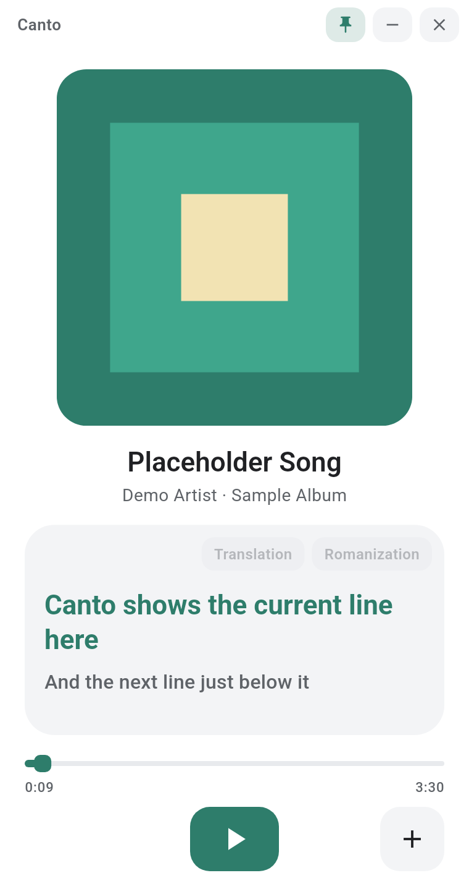
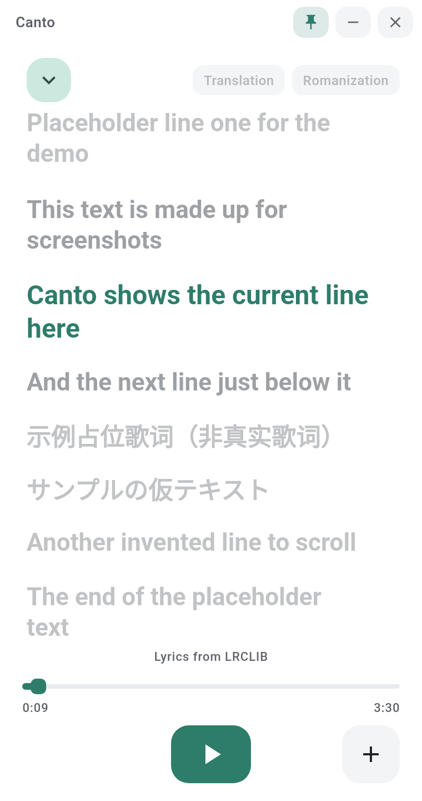
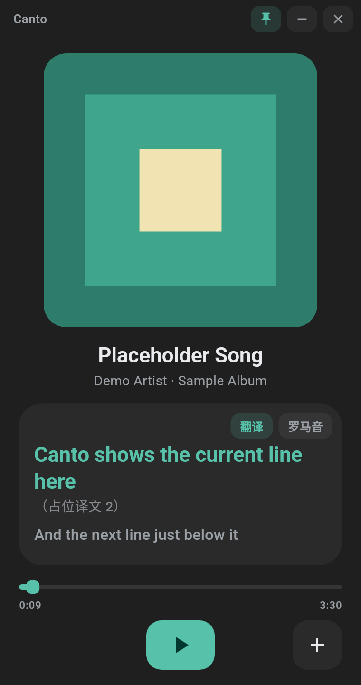
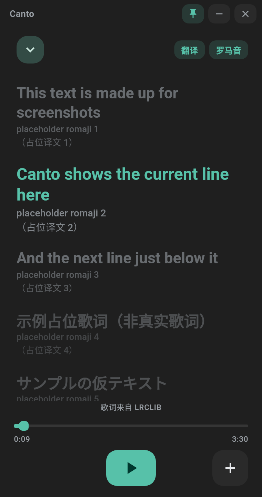

# Canto

[中文](#中文) · [English](#english)

*截图中的歌词均为虚构的占位文本。Screenshots use made-up placeholder text, not real lyrics.*

---

## 中文

Canto 是一个**个人学习项目，非营利**。它读取系统的“正在播放”信息，并从免费歌词服务（LRCLIB、LrcAPI、LrcShare）获取歌词显示出来。

- **Canto 不提供任何音乐**：不播放、不缓存、不转发音频，不集成任何音乐服务 SDK 或私有接口（Spotify / Apple Music / QQ音乐 / 网易云音乐 等）。
- **歌词版权归原权利人所有。** 歌词、译文、罗马音只在设备内存中临时保存当前曲目的数据，切歌或退出即丢弃；不会上传、记录日志、写入仓库或打包进应用。

### 歌词来源（均免费、无需 Key，按顺序逐个请求，不并发）
1. **[LRCLIB](https://lrclib.net)**（主要来源）：`/api/get`（曲名/歌手/专辑/时长）→ 去掉专辑再试 → `/api/search`（曲名+歌手）→ `/api/search?q=`（清洗后的标题）。优先带时间轴的 `syncedLyrics`，按时长最接近（±3 秒）选取；只有纯文本时整段显示不滚动；`instrumental` 显示“纯音乐”。
2. **[LrcAPI](https://api.lrc.cx)**（中文补充）：先请求文档中的 `/api/v1/lyrics/single` 与 `/api/v1/lyrics/advance`；目前这两个路径返回 404，因此回退到该服务的 `/jsonapi`（JSON 列表，只采用标题+歌手确实匹配且带时间轴的一条；不使用会返回“猜测结果”的 `/lyrics`，以免显示错误歌曲的歌词）。
3. **[LrcShare](https://lrcshare.com)**（小众人工整理曲库，含译文/罗马音/封面）：`/v1/search` → `/v1/lyric/:id?lyric_lines=1`。请求间隔 ≥300ms，不加防缓存参数。
4. 都没有 → “暂无歌词”。绝不编造歌词。歌词视图底部显示实际来源（LRCLIB / LrcAPI / LrcShare）。

所有请求带标识 User-Agent `Canto/0.1.1 (https://github.com/chinatsu033/Canto)`（同时附 `X-User-Agent`）；遇到 HTTP 429 指数退避（1s、2s，或遵循 Retry-After），不立即重试，多次失败后该来源暂停。

**翻译 / 罗马音**：仅来自 LrcShare（即使歌词来自 LRCLIB/LrcAPI，也会每首歌额外请求一次 LrcShare）。按时间戳对齐到当前显示的原文行，沿用原文时间戳，不重新计时；无法对齐或没有对应版本时开关变灰。译文优先简体中文（原文是中文时用英文）；罗马音：日语 ja-Latn、韩语 ko-Latn、中文 zh-Latn-pinyin（无则粤拼 jyutping）。两个开关默认关闭，可同时开启，设置会保存。
**封面强调色**：优先用系统会话的封面；没有封面时才用 LrcShare 的封面（仅本次播放、仅内存）。

感谢 LRCLIB、LrcAPI、LrcShare 提供免费服务。

### 功能
- 进度条可拖动跳转、双击歌词行跳到该行（需播放器支持跳转，否则进度条只读）；队列中的歌曲可点击切换（Android、Linux 支持）。
- 播放页：封面居中，下方只显示当前一句（和下一句）；点击歌词进入大字歌词视图，可滚动查看其他行，自动跟随当前行，手动滚动 4 秒后恢复跟随。
- 底部控制栏：播放/暂停、收藏。收藏图标随来源 App 变化：Spotify 为 ➕，QQ音乐/网易云/酷狗/酷我等国内 App 为 ♥，Apple Music 为 ☆。**只有当系统会话真的支持收藏时才会执行**，否则提示“不支持”，不会假装成功。
- 播放队列：仅当播放器公开了队列时显示（Android `MediaController.getQueue`、Linux MPRIS TrackList），否则完全不显示列表。
- 强调色取自当前封面的主色，每首歌更新；无封面时使用固定的中性蓝色。浅色模式白底，深色模式灰黑（#1F1F1F / #2A2A2A），跟随系统。所有按钮均为圆角方形。
- 桌面端：约 380×720 的竖屏小窗，默认置顶（可切换），无边框，自带拖动区、最小化与关闭按钮，实色背景。
- 语言：简体中文（默认）、繁體中文、日本語、English。

### 各平台“正在播放”来源与限制
| 平台 | 来源 | 说明 |
|---|---|---|
| Android | `NotificationListenerService` + `MediaSessionManager.getActiveSessions` | 需要在系统设置中授予“通知使用权”（只用于读取媒体会话，不读取通知内容）。支持标题/歌手/专辑/时长/进度/封面/播放控制/队列。收藏仅在播放器提供相应 custom action 或 rating 时可用。 |
| macOS | MediaRemote（私有框架，运行时加载）→ 回退 AppleScript（Music、Spotify） | **macOS 15.4 起 Apple 限制了第三方进程访问 MediaRemote**，通常读不到数据，此时自动回退到 AppleScript，只支持 Apple Music 和 Spotify（首次使用需在“系统设置 › 隐私与安全性 › 自动化”中允许）。其他播放器在 15.4+ 上读不到。可行的后续方案是 [mediaremote-adapter](https://github.com/ungive/mediaremote-adapter)（借助系统自带 `/usr/bin/perl` 加载框架），尚未集成。收藏仅支持 Apple Music（AppleScript `favorited`）。应用未签名/未公证：首次打开请右键 › 打开。 |
| Windows | `GlobalSystemMediaTransportControlsSessionManager`（WinRT） | 支持标题/歌手/专辑/时长/进度/封面/播放暂停/跳转。该 API 不提供收藏和队列，所以收藏显示为不支持、不显示队列。 |
| Linux | MPRIS（D-Bus） | 支持 MPRIS 的播放器均可（Spotify、VLC、浏览器等）。若播放器实现了 TrackList 则显示队列。MPRIS 没有标准的收藏命令，收藏显示为不支持。 |
| iOS / iPadOS | — | **不支持。** iOS 不允许第三方 App 读取其他 App 的正在播放信息。 |

### 构建
Flutter 3.47。`flutter test` 覆盖 LRC 解析、同步逻辑、歌词来源顺序、429 退避、LrcAPI 匹配、LrcShare 版本解析与时间戳对齐、多语言 key 覆盖（测试数据均为虚构）。打包脚本见 `packaging/`，CI 见 `.github/workflows/build.yaml`。

---

## English

Canto is a **personal learning project, non-profit**. It reads your system's now-playing info and shows lyrics fetched from free lyric services (LRCLIB, LrcAPI, LrcShare).

- **Canto does not provide any music.** It never plays, caches or forwards audio, and uses no music-service SDKs or private APIs (Spotify / Apple Music / QQ Music / NetEase Cloud Music, etc.).
- **Lyrics copyright belongs to the respective rights holders.** Lyrics, translations and romanizations are kept only in memory for the current track and dropped on track change or exit; never uploaded, logged, committed or bundled.

### Lyric sources (all free, no key; queried one at a time, never in parallel)
1. **[LRCLIB](https://lrclib.net)** (primary): `/api/get` (track/artist/album/duration) → without album → `/api/search` (track+artist) → `/api/search?q=` (cleaned title). Synced lyrics with the closest duration (±3 s) win; plain lyrics are shown as full text without scrolling; `instrumental` shows "Instrumental".
2. **[LrcAPI](https://api.lrc.cx)** (Chinese fallback): tries the documented `/api/v1/lyrics/single` and `/api/v1/lyrics/advance` first; these currently return 404, so it falls back to the service's `/jsonapi` (JSON list; only a verified title+artist match with timestamps is used — the guessing `/lyrics` endpoint is not used, to avoid showing the wrong song).
3. **[LrcShare](https://lrcshare.com)** (small curated catalog with translation/romanization/cover): `/v1/search` → `/v1/lyric/:id?lyric_lines=1`, ≥300 ms between requests, no cache-busting parameters.
4. Otherwise "No lyrics". Lyrics are never fabricated. The lyrics view shows the actual source (LRCLIB / LrcAPI / LrcShare).

Every request sends the User-Agent `Canto/0.1.1 (https://github.com/chinatsu033/Canto)` (plus `X-User-Agent`). HTTP 429 triggers exponential backoff (1 s, 2 s, or Retry-After), never an immediate retry; repeated 429s pause that source.

**Translation / romanization** come only from LrcShare (one extra LrcShare lookup per track, even when lyrics came from LRCLIB/LrcAPI). They are aligned to the displayed lines by timestamp and reuse the original timestamps (no re-timing); if no version exists or alignment fails, the toggle is greyed out. Translation prefers Simplified Chinese (English if the original is Chinese); romanization uses ja-Latn / ko-Latn / zh-Latn-pinyin (jyutping as fallback). Both toggles default off, can be combined, and are remembered.
**Accent color** uses the system session artwork; only if there is none, the LrcShare cover (this playback only, memory only).

Thanks to LRCLIB, LrcAPI and LrcShare for their free services.

### Features
- Draggable progress bar and double-tap a lyric line to seek (when the player supports seeking; otherwise display-only). Tap a queue item to switch to it (Android, Linux).
- Player page: centered artwork with only the current (and next) line below; tap to open the enlarged lyrics view, which auto-follows the current line and resumes 4 s after manual scrolling.
- Bottom bar: play/pause and favorite. Favorite icon depends on the source app: Spotify = plus, mainland-China apps (QQ Music, NetEase, Kugou, Kuwo…) = heart, Apple Music = star. **Favorite is only sent when the system session supports it**; otherwise a toast says it's unsupported — it never pretends to succeed.
- Queue: shown only when the player exposes one (Android `getQueue`, MPRIS TrackList); otherwise no list at all.
- Accent color is extracted from the album artwork per track, with a fixed neutral fallback. Light mode is white; dark mode is grey (#1F1F1F / #2A2A2A); follows the system. All controls are rounded squares.
- Desktop: ~380×720 portrait window, always-on-top by default (toggle), frameless with drag area, minimize and close, solid background.
- Languages: Simplified Chinese (default), Traditional Chinese, Japanese, English.

### Now-playing sources & limitations
| Platform | Source | Notes |
|---|---|---|
| Android | `NotificationListenerService` + `MediaSessionManager.getActiveSessions` | Requires granting Notification access (used only to reach media sessions; notification content is never read). Title/artist/album/duration/position/artwork/controls/queue. Favorite only if the player exposes a matching custom action or rating. |
| macOS | MediaRemote (private framework, loaded at runtime) → AppleScript fallback (Music, Spotify) | **Since macOS 15.4 Apple blocks MediaRemote for non-Apple processes**, so it usually returns nothing and Canto falls back to AppleScript for Apple Music and Spotify only (allow it under System Settings › Privacy & Security › Automation). Other players are not readable on 15.4+. A possible future route is [mediaremote-adapter](https://github.com/ungive/mediaremote-adapter) (loads the framework via the system `/usr/bin/perl`); not integrated yet. Favorite works for Apple Music only (AppleScript `favorited`). Unsigned/unnotarized: right-click › Open the first time. |
| Windows | `GlobalSystemMediaTransportControlsSessionManager` (WinRT) | Title/artist/album/duration/position/artwork/play-pause/seek. The API has no favorite or queue, so favorite shows unsupported and no queue is shown. |
| Linux | MPRIS over D-Bus | Any MPRIS player (Spotify, VLC, browsers…). Queue shown if the player implements TrackList. MPRIS has no standard favorite command → unsupported. |
| iOS / iPadOS | — | **Not supported.** iOS doesn't let third-party apps read other apps' now-playing info. |

### Build
Flutter 3.47. `flutter test` covers LRC parsing, sync logic, source order, 429 backoff, LrcAPI matching, LrcShare version parsing and timestamp alignment, and i18n key coverage (synthetic data only). Packaging scripts are in `packaging/`, CI in `.github/workflows/build.yaml`.

## License
MIT for the code. Lyrics are not part of this repository.
